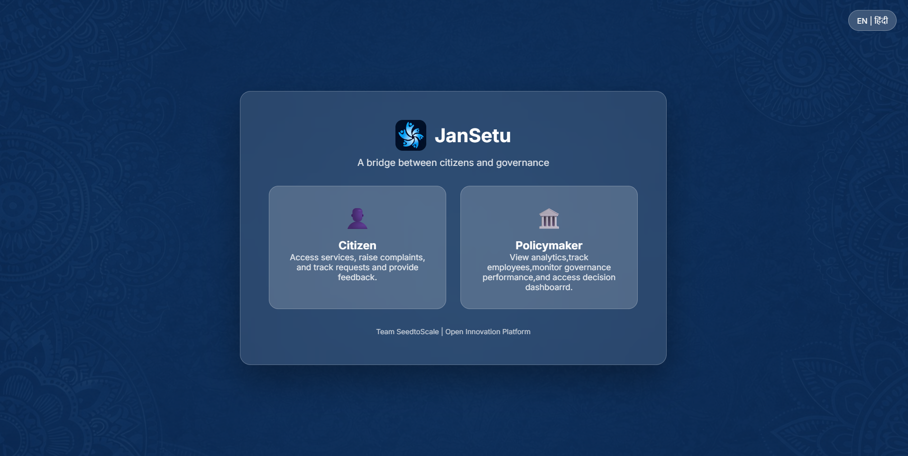

# 🚀 JanSetu

<div align="center">

<p align="center">
  
</p>


**PROJECT LINKS**

[Live Demo](https://hanya98.github.io/JanSetu) &nbsp;&nbsp;&nbsp;
[PPT Link](https://www.canva.com/design/DAG83rtJ7fY/7gVoMR7m93kUCM_VQwpM9w/edit?utm_content=DAG83rtJ7fY&utm_campaign=designshare&utm_medium=link2&utm_source=sharebutton) &nbsp;&nbsp;&nbsp;
[Video Link](https://www.canva.com/design/DAG9dLakXXM/bP0D7hTZ2SJtQWsK2A-B5Q/edit?utm_content=DAG9dLakXXM&utm_campaign=designshare&utm_medium=link2&utm_source=sharebutton)

</div>

## JanSetu – Unified Digital Governance Platform
JanSetu is a role-based digital governance platform designed to bridge the gap between citizens and policymakers by transforming civic interactions into actionable governance intelligence.
It enables transparent issue resolution, informed citizen participation, and data-driven public decision-making.


## 📖 Overview

Current grievance systems are reactive and closure-oriented. They collect complaints but fail to extract insights, detect recurring failures, or counter misinformation effectively.

JanSetu goes beyond complaint logging. It acts as a governance intelligence layer that connects:

Citizens (awareness, trust, participation)

Policymakers (insights, analytics, accountability)

Field workforce (monitoring and optimization)

## ✨ Features

## 👤 Citizen Features

-   **Smart Complaint Registration & Tracking:** Auto-categorization, duplicate detection, priority escalation, real-time tracking.
-   **Community Civic Forum:** AI-based issue clustering, urgency scoring, and sentiment analysis at locality level.
-   **Rumour Verifier & Misinformation Filtering:** AI-driven credibility checks and verified explanations.
-   **Verified News Feed:** Official, locality-specific government updates.
-   **Personalized Dashboard:** A user-centric dashboard providing an overview of personal complaints, community activities, and relevant information.
-   **Policies & Schemes Awareness Hub** Personalized discovery, eligibility hints, and fake-scheme detection.
-   **Multilingual & Inclusive Access** 

## 🏛️ Policymaker Features

-   **Complaint Insights Dashboard:** Root-cause analysis, trend detection, seasonal patterns, and cost-of-inaction insights.
-   **Policy Impact & Outreach Analytics:** Measure scheme reach, effectiveness, and gaps.
-   **Inter-Department Coordination Tools:** 
-   **Misinformation Monitoring & Control** 
-   **GeoMint Dashboard (Workforce Monitoring):** Verified check-ins, out-of-zone alerts, active workers, trust index, attendance and payroll insights.
-   **Digital Employee Service Book (Key USP)** 


## 🌍 Vision

To establish JanSetu as a national-scale governance intelligence platform that enables proactive, transparent, and citizen-centric public administration.


## 🖥️ Screenshots

<p align="center">
  
  <br/>
  <i>Homepage</i>
</p>

<br>

<p align="center">
  
  <br/>
  <i>Citizen Dashboard – personalized alerts, complaints, and community engagement</i>
</p>

<br>

<p align="center">
  
  <br/>
  <i>Policymaker Dashboard – complaint analytics, policy insights, and workforce monitoring</i>
</p>

## 🛠️ Tech Stack

**Frontend:**
-   
-   
-   
-   

**Backend:**
-   
-   
-   
-   
-   

**Database:**
-   
-   

**Development Tools:**
-   


## 📁 Project Structure

```
JanSetu/
├── .env.example        # Example environment variables
├── .gitignore          # Files/folders ignored by Git
├── bg.jpeg             # Background image asset
├── community.html      # Community discussion page
├── complaint.html      # Complaint submission page
├── dashboard.html      # User dashboard page
├── geomint.html        # Geospatial information/minting page
├── index.html          # Main landing page
├── jansetu.jpeg        # Project specific image asset
├── logo.jpeg           # Project logo
├── my_complaints.html  # Page to view user's complaints
├── package-lock.json   # npm dependency lock file
├── package.json        # Project metadata and dependencies
├── policy.html         # Policy information page
├── rumour_detector.html# Rumor detection tool page
├── rumours.html        # Rumors listing page
├── server.js           # Main Node.js backend application
├── server.js.backup    # Backup of server.js (can be safely removed)
└── user.html           # User profile page
```

## ⚙️ Configuration

### Environment Variables
Configure these variables in your `.env` file to customize the application's behavior.

| Variable       | Description                                  | Default      | Required |
|----------------|----------------------------------------------|--------------|----------|
| `PORT`         | Port number for the Express server.          | `3000`       | Yes      |
| `MONGODB_URI`  | Connection string for your MongoDB database. | `(localhost)`| Yes      |
| `JWT_SECRET`   | Secret key for signing and verifying JWTs.   | `(none)`     | Yes      |

### Configuration Files
-   **`.env`**: Stores sensitive configuration details and environment-specific settings.
-   **`package.json`**: Manages project dependencies and scripts.

## 🔧 Development

### Available Scripts
In the project directory, you can run:

| Command           | Description                                                        |
|-------------------|--------------------------------------------------------------------|
| `npm start`       | Starts the Node.js server in production mode.                      |
| `npm run dev`     | Starts the Node.js server in development mode using `nodemon`.     |
| `npm test`        | Placeholder for running tests. Currently outputs an error message. |

### Development Workflow
For active development, use `npm run dev`. Any changes saved in `server.js` or related backend files will automatically restart the server, reflecting your updates instantly.

## 🧪 Testing

The `package.json` includes a `test` script, but it's currently a placeholder.
```bash
# Run tests (currently a placeholder)
npm test
```
To implement testing, you would typically integrate a testing framework like Jest or Mocha.

## 🚀 Deployment

### Production Build
To prepare the application for production:
```bash
# Ensure dependencies are installed
npm install --production

# Start the server
npm start
```
It is recommended to use a process manager like PM2 or deploy on platforms like Heroku, Vercel (for frontend if separated), or a custom VPS with Nginx for reverse proxying for robust production deployment.

## 📚 API Reference

JanSetu's backend provides the following key API endpoints:

### Authentication
User authentication is handled via JWT. Upon successful login, a JWT is issued and stored as a cookie. All protected routes require a valid JWT.

### Endpoints

| Method | Endpoint              | Description                                  | Authentication Required |
|:-------|:----------------------|:---------------------------------------------|:------------------------|
| `GET`  | `/`                   | Serves the main landing page (`index.html`). | No                      |
| `GET`  | `/dashboard`          | Serves the user dashboard.                   | Yes                     |
| `GET`  | `/community`          | Serves the community page.                   | Yes                     |
| `GET`  | `/complaint`          | Serves the complaint submission page.        | Yes                     |
| `GET`  | `/my_complaints`      | Serves the page to view user's complaints.   | Yes                     |
| `GET`  | `/policy`             | Serves the policy information page.          | Yes                     |
| `GET`  | `/rumour_detector`    | Serves the rumor detection tool page.        | Yes                     |
| `GET`  | `/rumours`            | Serves the rumors listing page.              | Yes                     |
| `GET`  | `/geomint`            | Serves the geospatial minting page.          | Yes                     |
| `GET`  | `/user`               | Serves the user profile page.                | Yes                     |
| `POST` | `/register`           | Registers a new user account.                | No                      |
| `POST` | `/login`              | Authenticates a user and issues a JWT.       | No                      |
| `POST` | `/submit-complaint`   | Submits a new complaint.                     | Yes                     |
| `GET`  | `/logout`             | Clears the JWT cookie and logs out the user. | Yes (to clear cookie)   |

## 🤝 Contributing

We welcome contributions to JanSetu! If you have suggestions for improvements or want to report a bug, please open an issue or submit a pull request.


## 🙏 Acknowledgments

-   **Express.js**: For providing a robust web framework.
-   **Mongoose**: For elegant MongoDB object modeling.
-   **EJS**: For simple and effective server-side templating.
-   **Dotenv**: For seamless environment variable management.
-   **Bcrypt.js**: For secure password hashing.
-   **JSON Web Token**: For secure authentication.
-   **Nodemon**: For boosting development workflow.

## 📞 Support & Contact

-   📧 Email: hanyabatra@gmail.com
-   🐛 Issues: [GitHub Issues](https://github.com/hanya98/JanSetu/issues)
-   💬 Discussions:

---

<div align="center">

**⭐ Star this repo if you find it helpful!**

Made with ❤️ by our team

</div>
